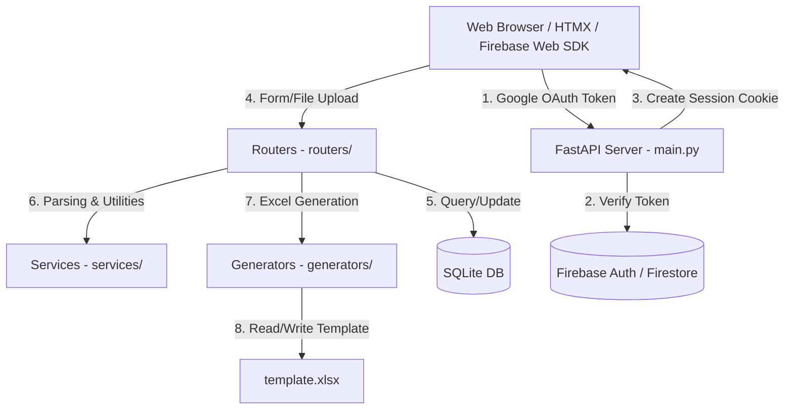

# Repository Guidelines

## Project Overview

**Audit Diary System** is a web-based Monthly Diary & TA Bill management system for bank auditors. It allows staff to:
- Upload and parse WhatsApp attendance messages.
- Log daily and monthly expenses (travel, hotel stays, local conveyance, other expenses).
- Upload and parse digital invoices/receipts (via OCR).
- Generate monthly Diary-cum-TA Bill reports (both standard and HRMS formats) using pre-formatted Excel templates.

The application is built on FastAPI, rendering server-side Jinja2 templates styled with Bootstrap 5.3 and custom CSS, and uses HTMX for asynchronous dynamic updates. Authentication is handled via Google Sign-In (Firebase Auth), and data is stored in a local SQLite database.

## Architecture & Data Flow



### Key Request & Data Flows

1. **Authentication Flow**:
   - The user signs in via Google OAuth on the frontend (`/auth/login`).
   - The frontend Firebase Auth JS SDK (v10.7.1) retrieves an ID token and POSTs it to `/auth/google-login`.
   - The backend verifies the token via Firebase Admin SDK. If a corresponding link is found in Google Firestore (`user_links` collection), the server generates a signed JWT session cookie (`access_token`) containing the user's ID.
   - If no link is found, the user is redirected to `/auth/setup` to link their staff number and mobile.
2. **Request Lifecycle**:
   - `Depends(get_db)` opens a yield-scoped SQLAlchemy session (auto-closed upon response).
   - `Depends(get_current_user)` or `Depends(login_required)` decodes the JWT cookie to yield the `User` object.
   - Route auth guards check roles: `login_required` -> `admin_required` -> `super_admin_required` / `permission_required("xxx")`.
   - Router handler queries SQLite via SQLAlchemy, processes business logic, and renders a `TemplateResponse` (Jinja2) or redirects.
3. **Attendance Extraction Flow**:
   - The user copies and uploads raw WhatsApp chat logs to `/attendance/upload-whatsapp`.
   - `services/whatsapp_parser.py` parses the text using regex, matching dates, branch names, DP codes, and identifying leaves via keyword matching.
   - Structuring matches creates `AttendanceRecord`s in the database. Missing weekdays are automatically filled as leaves with `source="auto"`.
4. **Expense Claims & OCR Flow**:
   - Users upload digital bills/invoices to `/bills/upload`.
   - `services/bill_parser.py` processes the upload using `pdfplumber` (for text extraction) or `pytesseract` OCR (for images, using `Pillow`).
   - The parser extracts vendor details, GSTIN, invoice date, amounts, and category (e.g. Hotel).
   - Users link individual Travel, Hotel, Local Conveyance, or Other Expense records to these uploaded bills.
5. **Excel Report Generation Flow**:
   - `generators/diary_excel.py` loads `template.xlsx` (an 875KB pre-formatted workbook).
   - It populates the workbook (Sheet1: Attendance Register, Sheet2: Daily Expense Breakdown, Sheet3: Summary with Other Expenses).
   - Safe cell modification is applied to merged cells (updating the top-left boundary of the merged range).
   - Column dimensions are dynamically autofitted (capped between 11 and 28 characters wide).
   - Print configurations are set to A4 paper, fit-to-width scaling, and horizontal centering.

## Key Directories

| Path | Purpose |
|---|---|
| `main.py` | FastAPI application entry point, mounts middleware/routers, and handles startup migrations. |
| `config.py` | Configuration settings class (Pydantic-Settings), loading `.env` variables and regional bank/GST/HRA constants. |
| `database/` | Database configuration (`db.py`) and SQLAlchemy ORM models (`models.py`). |
| `routers/` | FastAPI APIRouter modules for authentication, administration, attendance, bills, and expense types. |
| `services/` | Business logic services (WhatsApp parser, OCR bill parser, Firebase client-link wrapper, calendar utilities). |
| `generators/` | Excel generators for standard and HRMS formats using `openpyxl`. |
| `templates/` | Jinja2 templates (divided by resource: list, add, edit templates and layout base). |
| `static/` | Static assets, including the CSS design system (`style.css`). |
| `uploads/` | Staging directories for uploaded WhatsApp texts, digital bills, and generated reports. |

## Development Commands

### Local Environment Setup
```bash
# Set up virtual environment
python -m venv venv
venv\Scripts\activate      # Windows
source venv/bin/activate    # Linux/Mac

# Install dependencies
pip install -r requirements.txt
```

### Seeding Core Data
```bash
# Seed default users (admin credentials)
python seed.py

# Seed RBI bank holiday metadata for 2025/2026
python seed_holidays.py
```

### Running the Development Server
```bash
# Start development server on conventional port 9931
uvicorn main:app --reload --host 127.0.0.1 --port 9931

# Windows convenience scripts (kills port 9931 conflict first)
start_9931.bat
# or PowerShell alternative
powershell -File start_9931.ps1
```

### Running Migrations Manually
Schema changes are handled at startup via `_run_migrations()` in `main.py`. To execute a manual schema change:
```bash
python -c "
import sqlalchemy as sa
from database.db import engine
conn = engine.connect()
# Execute raw ALTER TABLE commands here
conn.commit()
conn.close()
"
```

### Production Deployment
```bash
# Deploy to Ubuntu/Debian server using the automated systemd wrapper
sudo bash deploy.sh
```

## Code Conventions & Common Patterns

### 1. Router Pattern
All routers adhere to a standard APIRouter pattern with uniform dependency injection:
```python
router = APIRouter(dependencies=[Depends(login_required)])
templates = Jinja2Templates(directory="templates")

@router.get("/list/{diary_id}")
def list_items(request: Request, diary_id: int, db: Session = Depends(get_db)):
    user = get_current_user(request, db)
    # Validate user ownership
    diary = db.query(MonthlyDiary).filter(MonthlyDiary.id == diary_id, MonthlyDiary.user_id == user.id).first()
    if not diary:
        raise HTTPException(status_code=404)
        
    items = db.query(ExpenseModel).filter(ExpenseModel.diary_id == diary_id).all()
    return templates.TemplateResponse("list_items.html", {
        "request": request, "user": user, "items": items, "diary": diary
    })
```

### 2. Authorization Dependency Chain
Defined in `routers/auth.py`:
- `get_current_user(request, db)`: Retrieves and decodes JWT `access_token` cookie. Returns `User` object or `None`.
- `login_required(request, db)`: Enforces logged-in state. Redirects to `/auth/login` if credentials are missing or expired.
- `admin_required(request, db)`: Enforces `is_admin` state.
- `super_admin_required(request, db)`: Grants access only to staff number `"861198"`.
- `permission_required("perm_name")`: Validates that `User.admin_permissions` contains the specified permission flag.

### 3. CRUD URL Naming conventions
Uniformly structured URLs for expense submodules:
1. `GET /list/{diary_id}` - Renders list view template.
2. `GET /add/{diary_id}` - Renders add form template.
3. `POST /add/{diary_id}` - Creates expense record, redirects to list with HTTP 302.
4. `GET /edit/{item_id}` - Renders edit form template.
5. `POST /edit/{item_id}` - Updates expense record, redirects to list with HTTP 302.
6. `POST /delete/{item_id}` - Deletes expense record, redirects to list with HTTP 302.

### 4. Database Lifecycle & Schema Design
- **Session Lifecycle**: Database sessions are opened and closed per request by FastAPI (`Depends(get_db)`).
- **Constraints**: Enforced via SQLite unique indices (e.g., `UniqueConstraint("user_id", "month", "year")` on MonthlyDiary).
- **Cascades**: Deletion cascades are enabled at the database schema level. Deleting a `MonthlyDiary` automatically deletes child legs, stays, conveyance, and bills.

### 5. Form Handling
- No Pydantic schema validation is used for request bodies in POST routes. FastAPI `Form(...)` is used directly.
- Templates submit using standard `<form method="POST">` with standard inputs.

### 6. CSS and UI Styling
Styled using Bootstrap 5.3 utilities and custom tokens in `static/style.css`.
Key Design System variables:
```css
--primary-900: #0f172a;  /* Dark Slate background */
--accent-500: #f59e0b;   /* Warm Amber accent */
--bg-main: #f8fafc;      /* Light page background */
```

## Important Files

| File Path | Role / Importance |
|---|---|
| `main.py` | App bootstrap, middleware setup, router attachments, database migrations. |
| `config.py` | Configuration settings class, default parameters, state codes, and allowances. |
| `database/models.py` | Contains all 9 SQLAlchemy ORM schemas: `User`, `MonthlyDiary`, `AttendanceRecord`, `Bill`, `TravelLeg`, `HotelStay`, `LocalConveyance`, `OtherExpense`, `Holiday`. |
| `routers/auth.py` | Core security gate, cookie handling, and token management. |
| `services/whatsapp_parser.py` | Parses raw chat transcripts; complex text parsing regex routines. |
| `services/bill_parser.py` | OCR and PDF parser orchestrator for invoice uploading. |
| `generators/diary_excel.py` | Writes user diary outputs to `template.xlsx` using `openpyxl`. |
| `templates/base.html` | Base layout containing head tags, the responsive sidebar, and notification toast handlers. |
| `template.xlsx` | The baseline blank Excel sheet loaded as the starting template for file generation. |

## Runtime/Tooling Preferences

- **Runtime**: Python 3.10+ is strictly required. No Node/Bun package management (pure Python project).
- **Database Engine**: SQLite exclusively (`audit_diary.db`).
- **Dependencies**:
  - `openpyxl==3.1.2` for spreadsheet operations.
  - `pytesseract==0.3.10` and `pdfplumber==0.11.0` for text and bill extraction. Requires system-installed binary for Tesseract OCR.
  - `firebase-admin>=6.0.0` for admin auth integrations. Requires service account JSON file in root.
- **Port Mapping**: Defaults to `9931` for local development.

## Testing & QA

- **No Integrated Test Framework**: There is no standard runner (like `pytest` or `unittest`) configured.
- **Verification Scripts**: Verification is handled via manual, standalone scripts:
  - `test_parse.py`: Validates WhatsApp parser regex logic.
  - `_t.py`: Exercises `generators/diary_excel.py` with mock entities and checks sheet formula validity.
  - `inspect_template*.py` (1 to 4): Audits `template.xlsx` workbook structure, formulas, and cells via openpyxl.
  - `_check_db.py`: Inspects SQLite database out-of-band.
- **Verification Priority**: When modifying services, run the respective test script (`test_parse.py` for parsers, `_t.py` for excel logic) and ensure output calculations remain correct.
